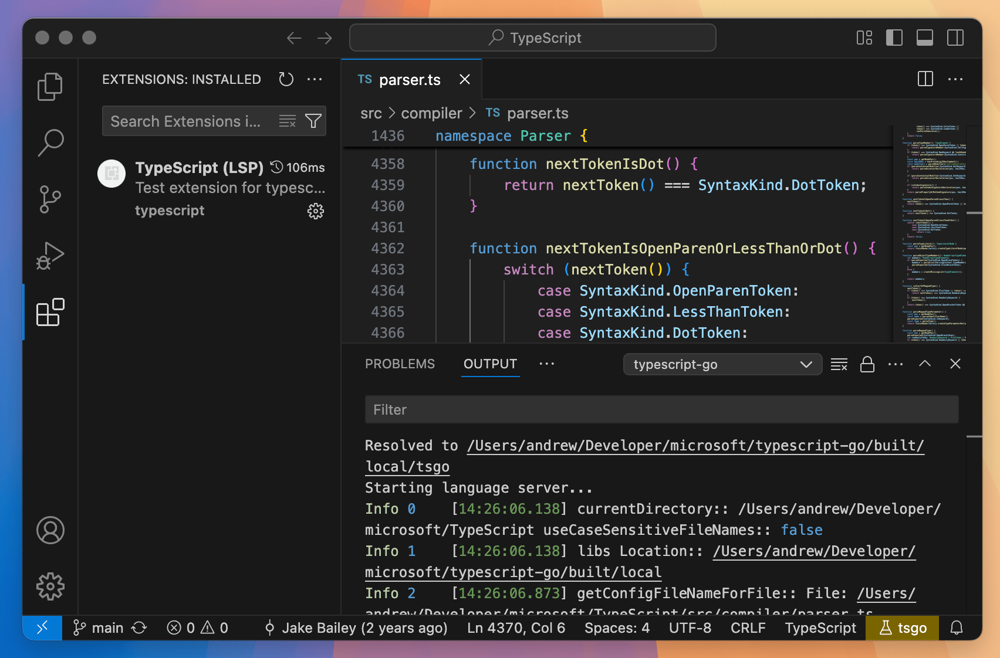

# Contributing

## How to Build and Run

This repo uses [Go 1.25 or higher](https://go.dev/dl/), [Rust 1.85 or higher](https://www.rust-lang.org/tools/install), [Node.js with npm](https://nodejs.org/), and [`hereby`](https://www.npmjs.com/package/hereby).

For tests and code generation, this repo contains a git submodule to the main TypeScript repo pointing to the commit being ported.
When cloning, you'll want to clone with submodules:

```sh
git clone --recurse-submodules https://github.com/microsoft/typescript-go.git
```

If you have already cloned the repo, you can initialize the submodule with:

```sh
git submodule update --init --recursive
```

With the submodule in place and `npm ci`, you can run tasks via `hereby`, similar to the TypeScript repo:

```sh
hereby build          # Build the tsgo binary (not required for tests)
hereby test           # Run tests
hereby format         # Format the code
hereby lint           # Run linters
hereby install-tools  # Install additional tools such as linters
hereby generate       # Generate all Go code (e.g. diagnostics, committed to repo)
```

Additional tasks are a work in progress.

`hereby` is not required to work on the repo; the regular `go` tooling (e.g., `go build`, `go test ./...`) will work as expected.
`hereby` tasks are provided as a convenience for those familiar with the TypeScript repo.

### Running `tsgo`

After running `hereby build`, you can run `built/local/tsgo`, which behaves mostly the same as `tsc`.

### LSP Server

To debug and run the VS Code extension without installing it globally:

* Run VS Code in the repo workspace (`code .`)
* Copy `.vscode/launch.template.json` to `.vscode/launch.json`
* <kbd>F5</kbd> (or `Debug: Start Debugging` from the command palette)

This will launch a new VS Code instance which uses the Corsa LS as the backend. If correctly set up, you should see "tsgo" in the status bar when a TypeScript or JavaScript file is open:


