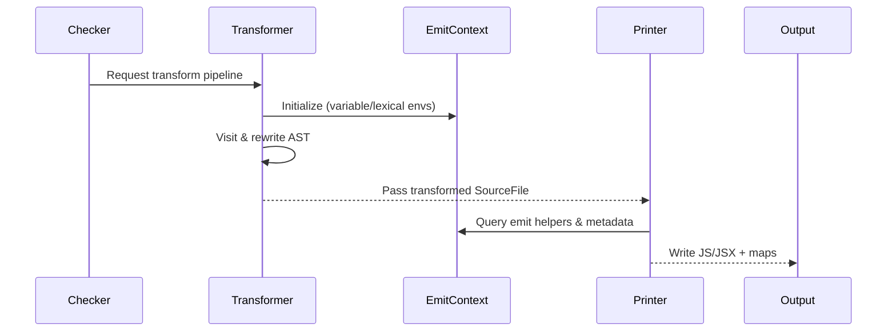

# PrettyScript Compiler Architecture

This document is a guided tour through the PrettyScript compiler (a Go port of the TypeScript compiler). It explains how a source file flows through the system, highlights the major packages, clarifies internal jargon, and captures the most important data structures that power the toolchain.

## Bird's-eye view

At run time, a `Program` ties these stages together, using configuration from `tsconfig` files, module resolution, and project references to decide which files to parse, bind, check, transform, and emit.

## Program orchestration

* `ProgramOptions` collect the compiler host, parsed `tsconfig` (`ParsedCommandLine`), checker pool factory, and project metadata.【F:internal/compiler/program.go†L30-L69】  The `Program` caches diagnostics, remembers which source files must be emitted, and tracks unresolved imports.
* A `CompilerHost` exposes file-system and configuration services such as reading source text, tracing, and discovering project references. The default implementation reads from the virtual file system (`vfs.FS`) and parses source files through the parser package.【F:internal/compiler/host.go†L13-L88】
* `Program.BindSourceFiles` runs the binder on every parsed file using a `WorkGroup`, enabling parallel or single-threaded execution based on compiler options.【F:internal/compiler/program.go†L331-L345】【F:internal/core/workgroup.go†L11-L90】
* `Program.CheckSourceFiles` leases checker instances from the `CheckerPool` so each worker can type-check its assigned subset of files concurrently.【F:internal/compiler/program.go†L347-L361】【F:internal/compiler/checkerpool.go†L14-L88】
* Diagnostic requests (`GetSyntacticDiagnostics`, `GetSemanticDiagnostics`, etc.) ensure binding and checking have occurred before aggregating results, so tooling layers can lazily materialize work only when needed.【F:internal/compiler/program.go†L401-L420】

### Supporting services

* Module resolution data (`resolvedModules`) is cached on the program so repeated lookups can be answered without re-walking the file graph.【F:internal/compiler/program.go†L380-L399】
* The `Program` cooperates with project reference mappers to redirect imports to source or declaration outputs when necessary, mirroring the behavior of the upstream TypeScript server.【F:internal/compiler/program.go†L109-L151】

## Source ingestion & configuration

* Parse options (`SourceFileParseOptions`) capture the filename, path, per-file compiler options, and JSDoc parsing mode, allowing the parser to respect settings such as JSX emit modes and module detection heuristics.【F:internal/ast/parseoptions.go†L17-L104】
* The compiler host pulls file contents from the virtual file system abstraction, then invokes `parser.ParseSourceFile` with the resolved `ScriptKind` so TS, TSX, JS, and JSON files are lexed appropriately.【F:internal/compiler/host.go†L77-L88】【F:internal/parser/parser.go†L112-L120】

## Lexical analysis

* The `scanner.Scanner` understands TypeScript keywords, punctuation, numeric formats, Unicode escapes, and template literal rules. It also reports diagnostics through callbacks, enabling the parser to surface lexical errors without halting compilation.【F:internal/scanner/scanner.go†L1-L160】
* Parsers maintain scanner instances in a sync.Pool, so lexers can be recycled between files to reduce allocations and warm caches across incremental builds.【F:internal/parser/parser.go†L103-L121】

## Parsing

* `ParseSourceFile` initializes parser state, consumes tokens, and dispatches to grammar-specific entry points (such as `parseSourceFileWorker` or JSON parsing).【F:internal/parser/parser.go†L112-L195】
* Every AST node is allocated through an `ast.NodeFactory`, which tracks pools for the most common node kinds. The factory wires in hooks for creation, updates, and cloning so downstream transformers can observe mutations.【F:internal/ast/ast.go†L31-L109】
* Resulting `*ast.SourceFile` nodes carry parent pointers, textual ranges, script kind, flag bits (e.g., “possibly contains JSX”), and statement lists, providing a uniform tree structure for subsequent stages.【F:internal/ast/ast.go†L222-L337】

### Terminology

* **SourceFile** – the root AST node returned by the parser for each file.
* **ScriptKind** – categorizes the file format (TS, TSX, JS, JSX, JSON) and drives grammar rules.
* **Node Flags** – bitmasks describing syntactic facts (async function, `export` keyword presence, etc.) that enable quick checks during binding and transforms.

## Binding

* Binding augments the AST with symbol tables, control-flow graphs, and scope metadata. Container flags classify nodes that introduce new lexical environments, control-flow segments, or `this` bindings.【F:internal/binder/binder.go†L17-L76】
* `binder.BindSourceFile` ensures each file is bound at most once, pulling binders from a sync.Pool, configuring strict-mode behavior, and recording classifiable identifiers for language service features.【F:internal/binder/binder.go†L93-L129】
* Symbol declaration helpers (`declareSymbol`) merge declarations, detect conflicts, and mark synthetic constructs such as computed property names or default exports, mirroring TypeScript’s multi-meaning symbol system.【F:internal/binder/binder.go†L132-L200】

### Jargon

* **Symbol Table** – a map from names to `*ast.Symbol` instances, scoped per container and used by the checker for lookup and emit decisions.
* **Flow Nodes** – graph nodes representing control-flow states (reachable, unreachable, true/false branches) used during type narrowing.
* **Active Labels** – stack of loop/switch labels to validate `break`/`continue` statements.

## Type checking

* The `Checker` traverses bound ASTs, performing grammar validation, type inference, contextual typing, and control-flow analysis. Entrypoint `CheckSourceFile` skips declaration-only files when allowed, then drives grammar and semantic passes before running unused identifier checks.【F:internal/checker/checker.go†L2083-L2117】
* `checker.types.go` defines the type system entities—signatures, format flags, symbol link records, deferred instantiations—mirroring TypeScript’s complex aliasing and inference machinery.【F:internal/checker/types.go†L1-L200】
* The `CheckerPool` lazily creates the configured number of checker instances, assigning source files round-robin so each goroutine maintains consistent caches while still parallelizing across the project.【F:internal/compiler/checkerpool.go†L14-L88】

### Common terms

* **Contextual typing** – Inferring a type for an expression from its usage site (e.g., lambda assigned to a typed variable).
* **Type Format Flags** – Control how types are converted to strings for diagnostics, quick info, or emit helpers.
* **Symbol Links** – Side tables caching resolved types, write types, and alias chains for each symbol instance.

## Transformation and emission

* Transformers operate on the AST to desugar language features (e.g., module emit, decorator lowering). A `transformers.Transformer` wraps an `EmitContext`, creating visitors and factories that can rewrite nodes while tracking generated declarations.【F:internal/transformers/transformer.go†L1-L41】
* The `printer.EmitContext` owns pools for synthetic statements, helper requests, lexical environments, and comment/source-map metadata, enabling transformations to record hoisted declarations and helper usage before printing.【F:internal/printer/emitcontext.go†L16-L668】
* The `printer.Printer` converts AST nodes into JavaScript and declaration text. It tracks write state, manages source map generation, and exposes hooks for tooling to observe emission events.【F:internal/printer/printer.go†L1-L200】

## Infrastructure & module system

* The `vfs.FS` interface abstracts file-system access (case sensitivity, directory walks, symlinks) so the compiler can target disk, in-memory, or cached file systems interchangeably.【F:internal/vfs/vfs.go†L1-L79】
* Work scheduling honors the `singleThreaded` flag; `core.NewWorkGroup` switches between parallel goroutines and deterministic single-threaded execution, simplifying reuse in IDEs and CLIs.【F:internal/core/workgroup.go†L11-L91】
* Module resolution caches (within `Program`) map `import` specifiers to resolved files, storing mode-aware keys so ESM/CJS differences are respected without recomputing on every lookup.【F:internal/compiler/program.go†L380-L399】

## Key data structures at a glance

| Concept | Definition & Usage |
| --- | --- |
| `ast.Node` | Base struct for every AST element, storing kind, flags, text range, parent, and a `nodeData` payload that provides accessors for child lists, symbols, and flow data.【F:internal/ast/ast.go†L222-L337】 |
| `ast.NodeFactory` | Pooled allocator that builds nodes and node lists while firing creation/update hooks, minimizing GC pressure during parsing and transforms.【F:internal/ast/ast.go†L31-L109】 |
| `ast.SourceFile` | Specialized node returned by the parser representing an entire file, including statements, EOF token, script kind, and metadata (module indicators, implied format, etc.).【F:internal/parser/parser.go†L112-L195】【F:internal/ast/parseoptions.go†L17-L104】 |
| `ast.Symbol` | Named entity produced by the binder that links declarations, merges flags, and caches per-meaning metadata; stored in symbol tables on containers.【F:internal/binder/binder.go†L132-L200】 |
| `checker.Type` records | Structures in `types.go` capture signature kinds, type format flags, and symbol link tables needed for inference and diagnostics.【F:internal/checker/types.go†L1-L200】 |
| `printer.EmitContext` | Shared state for emit-time features such as helper tracking, lexical environments, synthetic comments, and source map ranges.【F:internal/printer/emitcontext.go†L16-L668】 |

## Glossary

* **Program** – The compilation unit controller that owns source files, diagnostics, checker pools, and module resolution caches.【F:internal/compiler/program.go†L30-L420】
* **CompilerHost** – Abstraction for reading files, retrieving configuration, and realpath handling across different environments.【F:internal/compiler/host.go†L13-L88】
* **WorkGroup** – Scheduler that queues binder or checker tasks either in parallel goroutines or sequentially based on the `singleThreaded` flag.【F:internal/core/workgroup.go†L11-L90】
* **CheckerPool** – Allocates and assigns checker instances to files, ensuring type cache consistency while enabling concurrency.【F:internal/compiler/checkerpool.go†L14-L88】
* **Emit Helpers** – Runtime support snippets requested via the `EmitContext` when lowering advanced language features (e.g., async/await helpers).【F:internal/printer/emitcontext.go†L652-L709】

With these components, PrettyScript faithfully mirrors the TypeScript compiler pipeline while taking advantage of Go’s concurrency primitives, object pools, and modular package layout to support both command-line compilation and language service scenarios.
